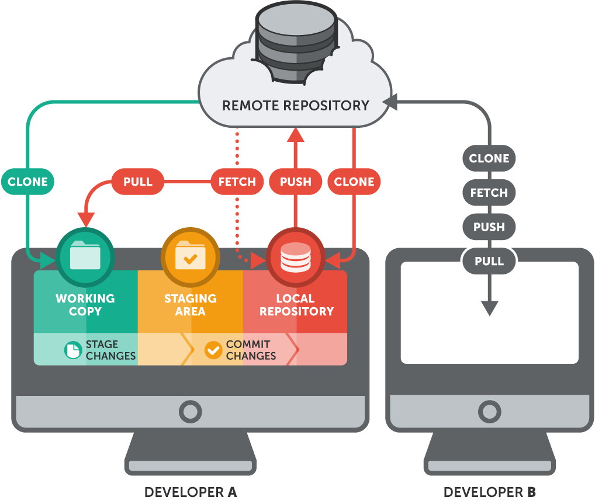

# Introduction to Version Control Systems 

### Table of contents:

- [Brief introduction](#brief-introduction)
  - [Git](#git)
  - [Advantages of using git](#advantages-of-using-git)
  - [Main components of the Local Version Control System](#main-components-of-the-local-version-control-system)
  - [Remote Repository](#remote-repository)
  - [Holistic scheme of a Version Control System](#holistic-scheme-of-a-version-control-system)
- [Hands-on](#hands-on)
  - [Local repository usage](#local-repository-usage)
    - [Configurate user](#configurate-user)
    - [Initiate repository](#initiate-repository)
    - [Add files](#add-files)
    - [Save alterations](#save-alterations)
    - [Ignore files](#ignore-files)
    - [Retrocess changes](#retrocess-changes)
  - [Remote repository usage and collaboration](#remote-repository-usage-and-collaboration)
    - [Work with remote connections](#work-with-remote-connections)
    - [Obtain remote changes](#obtain-remote-changes)
    - [Send alterations](#send-alterations)
    - [Integrate remote alterations](#integrate-remote-alterations)

# Brief introduction

## Git

- Git is not the same as Github;
- Git is a Version Control System (VCS) for the detection of file changes. 
In particular, Git is mostly used for the management of source code in software development.
- Github as well as Sourceforge, Gitlab and so on are host systems of Git repositories.

## Advantages of using Git

- Support of non-linear software development
  - It allows the development of different parts of a software by more than one developer, concurrently.
- Distributed development
  - It allows more than one developer to change the same file and merge their alterations. Without a VCS, the alteration of a file would overrite the file completely!
- Safeguards
  - It allows you to save your code at any time, even if the code is deleted.

## Main components of the Local Version Control System

The main components of a local VCS are the working directory, the staging area, and the local repository.


* Source: https://medium.com/@lucasmaurer/git-gud-the-working-tree-staging-area-and-local-repo-a1f0f4822018

- Working directory: a directory in your computer where you have your work scripts.
- Staging area: an intermediate "area" where Git can track and save the files alterations. 
The staging area is an intermediate stage between the working directory and the local repository.
- Local repository: repository where all the files checkpoints, changes and commits are locates. 
It is a copy of your working directory at some point in time.

The staging area is able to track the changes in your working directory's files whenever those files are ADDed to the Staging Area.
The following command is:

```shell
git add hello_world.py # in the case you want to add this file
```

The changes in your files can be registered and copied to your local repository using the following command:

```shell
git commit -m "[ADD] file" # -m stands for "message"
```


## Remote repository

A remote repository is a Git repository hosted on the Internet or in an another network.
It essentially consists in a copy of your local repository and local repositories of your colleagues.

Such service allows to work in a project concurrently in different parts of the source code as well as collaborative work.


* Source: https://www.atlassian.com/git/tutorials/syncing

## Holistic scheme of a Version Control System

The image bellow showcases the general workflow of a VCS. In Git, there are only a mere handful of commands that interact with a remote repository.

The overwhelming majority of work happens in the local repository. Until this point (except when we called "git clone"), we've worked exclusively with our local Git repository and never left our local computer. We were not dependent on any internet or network connection but instead worked completely offline.

We'll look at each of these commands in the course of the following sections. 


* Source: https://www.git-tower.com/learn/git/ebook/en/command-line/remote-repositories/introduction

# Hands-on

## Local repository usage

### Configurate user

```shell
git config  --global user.name "<your name>"
git config  --global user.email "<your e-mail>"
git config --list
```

### Initiate repository

```shell
git init –b main
git show
```

### Add files

```shell
git add .
git status
echo $'# README\n\nvcs workshop\n' > readme.md
mkdir data
echo $'22,11,22\n33,22,33\n' > data2.csv
git add readme.md
git status
```

### Save alterations

After staging the updates of our code/files, it is now necessary to save in Git history.
Each signature will store several information such as:

- The base signature;
- The changes done;
- Information associated with who made the changes;
- An identifier of that signature;
- A message explaining what have been made;

```shell

git commit  --m "[ADD] hello world"
git status

```

### Ignore files

What if our data are too large to store in either a remote or local repository? This can be quite problematic as Git has a file size limit.

You can add a special file entitled ".gitignore". This file can contain name or pattern names of specific files you want to ignore.

Example:

```shell

echo "*.csv\n" > .gitignore  # all CSV file
echo "data/" >> .gitignore # all the content in the "data" folder
git add .
git status
git commit  -m "added gitignore file"
git log

```

### Retrocess changes

```shell

echo "Some more info about the workshop" >> readme.md
git add .
git status
git restore  --staged .
git status

```

## Remote repository usage and collaboration

### Work with remote connections

```shell

git remote –v
git add .
git remote add github_repo https://github.com/nebi-um/version-control-tutorial.git # ADD A REMOTE REPOSITORY
git remote –v

```

### Obtain remote changes

```shell

git fetch –all
git fetch <github_repo>
git fetch <github_repo> main

```

### Send alterations

```shell

git push <github_repo> main

```

### Integrate remote alterations

```shell

git pull <github_repo> main

```

### Clone a remote repository

```shell

git clone https://github.com/nebi-um/version-control-tutorial.git

```
